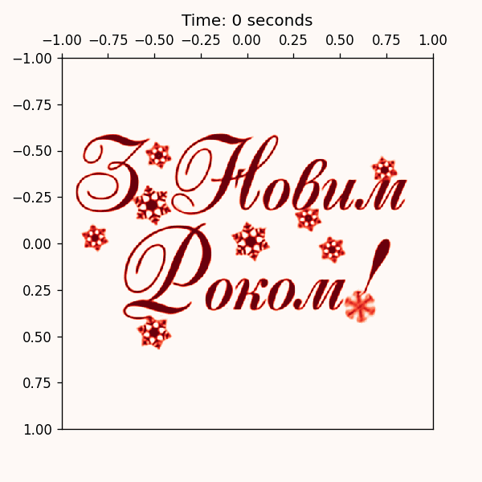

# Heat equation solver

Solve heat equation with neural nets (<a href="https://arxiv.org/abs/2006.09661">SIRENs</a>).

## Example

Train a neural net and save weights to `new_year_heat.pt`:
```bash
python3 train.py --image new_year.png --model_path new_year_heat.pt
```

Save visualization to gif:
```bash
python3 visualize.py --model_path new_year_heat.pt --min_t 0 --max_t 5 --spatial_resolution 300 --out_path animation.gif
```




## Prerequisites

Python env:
- python 3.10
- torch 2.1
- numpy 1.26
- matplotlib 3.8

Other combinations might also work
